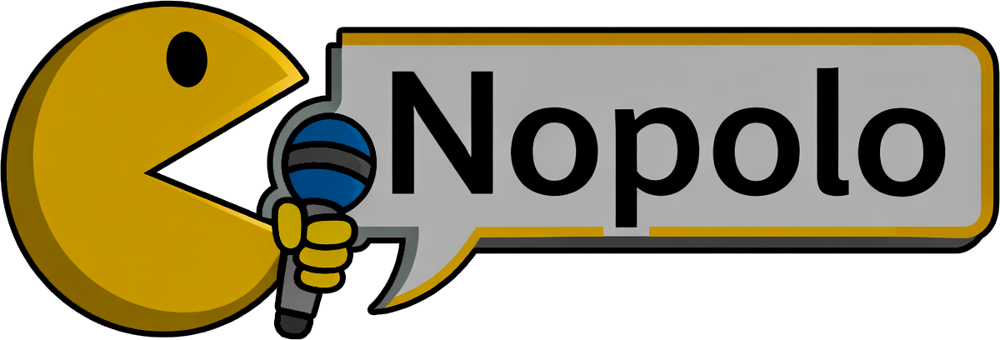
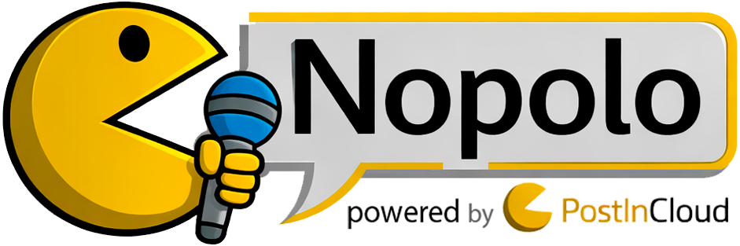

# Nopolo

<p align="center">
  
</p>

<table>
<tr>
<td width="60%">

**Nopolo** es una herramienta open source de síntesis de voz (TTS) con conversión de personajes mediante RVC, diseñada para creadores de contenido que quieren dar vida a sus streams, videos o bots.

Nació como una alternativa libre a herramientas de pago como Mopolo TTS, con el objetivo de que cualquiera pueda usar síntesis de voz profesional sin suscripciones ni servicios cerrados.

</td>
<td width="40%" align="center">

</td>
</tr>
</table>

El proyecto funciona **completamente local** en tu equipo, sin depender de servicios cerrados ni suscripciones. Es una alternativa libre a herramientas de pago como Mopolo TTS.

---

## 🌐 Compatibilidad Multiplataforma

| Sistema | Estado | Device | Método F0 | Notas |
|---------|--------|--------|-----------|-------|
| **Windows + NVIDIA** | ✅ Completo | CUDA | RMVPE | Máximo rendimiento |
| **Linux + NVIDIA** | ✅ Completo | CUDA | RMVPE | Máximo rendimiento |
| **macOS (M1/M2/M3)** | ✅ Optimizado | CPU | Parselmouth | Estable, ligeramente más lento |
| **Windows/Linux sin GPU** | ✅ Funcional | CPU | RMVPE | Más lento pero funcional |

> **Nota para usuarios de Mac:** Nopolo detecta automáticamente macOS y ajusta el procesamiento para evitar problemas con MPS. Usa el script `./run_nopolo.sh` para mejor rendimiento.

---

## ⚠️ Windows SmartScreen

Al ejecutar Nopolo por primera vez en Windows, es posible que aparezca el mensaje **"Windows protegió tu PC"** o **"Aplicación no reconocida"**.

Esto ocurre porque Nopolo es un proyecto open source gratuito y **no tiene una firma de código comercial** (costosa y no viable para proyectos sin fines de lucro). No es un virus ni malware — puedes revisar el código fuente completo en este repositorio.

**Para ejecutarlo igual:**
1. Haz clic en **"Más información"**
2. Haz clic en **"Ejecutar de todas formas"**

> Este aviso desaparece automáticamente a medida que más usuarios descargan y ejecutan la aplicación sin reportar problemas.

---

## ☕ Apoya el Proyecto

<p align="center">
  <a href="https://ko-fi.com/postincloud">
    
  </a>
</p>

<p align="center">
  <a href="https://www.youtube.com/@postincloud1">
    
  </a>
  &nbsp;&nbsp;&nbsp;
  <a href="https://www.twitch.tv/postincloud">
    
  </a>
</p>

<p align="center">
  <a href="https://ko-fi.com/postincloud">
    ☕ Si quieres apoyar al creador y mantenimiento, dame un café
  </a>
</p>


---

🚀 ¿Qué hace StreamTTS?

StreamTTS permite transformar texto en audio usando voces naturales y luego convertir ese audio a voces de personajes mediante modelos de conversión de voz.

Actualmente el flujo es:
```
Texto
 → TTS (voz natural)
 → Conversión de voz (RVC)
 → Reproducción de audio
```

El objetivo es que cada mensaje pueda reproducirse con múltiples voces, aplicar efectos de sonido, y reaccionar a eventos (por ejemplo, mensajes de chat o alertas de stream).

---

✨ Características

    🔊 Text-to-Speech con voces naturales

    🎭 Conversión de voz a personajes (ej. Homero Simpson)

    🧠 Uso de modelos entrenados (.pth / .index)

    💻 Ejecución completamente local (CPU / GPU)

    ⚡ Aceleración por GPU (CUDA)

    🧩 Arquitectura modular (TTS, RVC, cola de audio)

    🖥️ Interfaz gráfica simple (Qt / PySide6)

    🔓 Open source y extensible

---

🎯 Enfoque del proyecto

StreamTTS está diseñado como una herramienta para creadores de contenido, pero también como una base sólida para:

Bots de streaming

Integración con herramientas como Streamer.bot

Automatización de eventos

Proyectos experimentales de voz

El proyecto se mantiene open source porque actualmente la mayoría de herramientas similares son de pago o limitan fuertemente el uso gratuito.

---

🛠️ Tecnologías usadas

Python 3.10

PySide6 (interfaz gráfica)

edge-tts (síntesis de voz)

RVC (Retrieval-based Voice Conversion)

PyTorch + CUDA

sounddevice / pydub

---

📂 Estructura del proyecto
```
StreamTTS/
├─ main.py
├─ core/
│  ├─ tts_engine.py
│  ├─ rvc_engine.py
│  ├─ audio_queue.py
│  └─ audio_player.py
├─ gui/
│  └─ main_window.py
├─ rvc/                  # RVC clonado
├─ voices/               # Modelos de voz (.pth / .index)
├─ assets/
└─ README.md
```
---
## 🔮 Próximos pasos

- [x] Soporte multiplataforma (Windows, Linux, macOS)
- [x] API REST con documentación interactiva
- [x] Multi-provider TTS (Edge TTS + Google Cloud TTS)
- [x] Soporte para múltiples voces por mensaje (sintaxis Mopolo)
- [x] Sistema de efectos de sonido integrado
- [x] Filtros de audio (reverb, phone, pitch, robot, etc.)
- [x] Filtros de fondo (ambiente/contexto durante la voz)
- [x] Endpoint API `/synthesize/advanced` para mensajes complejos
- [ ] Modulo de entrenamiento de modelos RVC personalizados
- [x] Optimización de latencia
- [ ] Traduccion a otros idiomas (inglés, portugués, etc.)
- [ ] Integración directa con Streamer.bot
- [ ] Configuración avanzada desde la interfaz
- [ ] Mejoramiento en la entonación y naturalidad de las voces TTS

---

## 🎭 Mensajes Multi-Voz (Formato Mopolo)

Nopolo soporta mensajes complejos con múltiples voces, efectos de sonido y filtros de audio usando la sintaxis de Mopolo TTS.

### Sintaxis Básica

**Voces:**
```
nombre: texto a decir
id: texto a decir
```

**Sonidos:**
```
(nombre_sonido)
(id_sonido)
```

**Filtros de Audio:**
```
nombre.filtro: texto con filtro
nombre.filtro1.filtro2: texto con múltiples filtros
```

### Filtros Disponibles

| ID  | Nombre      | Descripción                    | Ejemplo                |
|-----|-------------|--------------------------------|------------------------|
| r   | Reverb      | Eco/reverberación              | `dross.r: con eco`     |
| p   | Phone       | Llamada telefónica             | `enrique.p: alló`      |
| pu  | Pitch Up    | Voz más aguda (+5 semitonos)   | `homero.pu: chiflado`  |
| pd  | Pitch Down  | Voz más grave (-5 semitonos)   | `dross.pd: profundo`   |
| m   | Muffled     | Voz apagada/de lejos           | `5.m: desde afuera`    |
| a   | Robot       | Voz robótica/android           | `robot.a: beep boop`   |
| l   | Distortion  | Voz saturada/distorsionada     | `metal.l: gritando`    |

### Ejemplos de filtros de Fondo

Mezclan un audio de ambiente/contexto **durante** toda la frase:

| ID  | Nombre        | Descripción                    | Ejemplo                        |
|-----|---------------|--------------------------------|--------------------------------|
| fa  | Calle         | Tráfico y ambiente urbano      | `dross.fa: en la calle`        |
| fb  | Lluvia        | Sonido de lluvia               | `narrador.fb: bajo la lluvia`  |
| fc  | Multitud      | Restaurante/lugar público      | `streamer.fc: en el evento`    |
| fd  | Naturaleza    | Viento, playa, pájaros         | `5.fd: en la playa`            |
| fe  | Personalizado | Definido por el usuario        | `voz.fe: con fondo custom`     |

**Nota:** Los archivos de fondo se configuran en `config/backgrounds.json` y se colocan en la carpeta `backgrounds/`.

### Ejemplos Completos

**Conversación simple:**
```
dross: hola amigos (disparo) homero: doh!
```

**Con filtros:**
```
enrique.p: alló, te puedo escuchar? dross.r: si, con eco
```

**Con fondos:**
```
reportero.fa: estamos en vivo desde la calle principal (sirena) testigo.m: escuche todo desde adentro
```

**Combinando todo:**
```
dross: bienvenidos al video (aplauso) narrador.fb.r: era una noche lluviosa homero.pu: doh! (risa)
```

### Configuración de Efectos de Sonido y Sonidos de fondo

Para configurar ambos, es necesario editar los archivos `config/sounds.json` y `config/backgrounds.json`.
O la mejor opción es usar la interfaz gráfica de configuración.

Puede usar el siguiente enlace para descargar contenido para Nopolo (Audios y Fondos):
[Descargar contenido para Nopolo (Google Drive)](https://drive.google.com/drive/folders/1rBW0eycWrFqZbRiXQYjJFG-CNH-ej5MU?usp=sharing)

Aqui puede encontrar algunas voces entrenadas por mi para usar con Nopolo:
[Modelos de voz para Nopolo (Google Drive)](https://drive.google.com/drive/folders/1B6GrZ4XPcpPiMGj0c9rEuvfxuvaP8BKz?usp=sharing)

### Scripts de Prueba

**Generar fondos de prueba:**
```bash
python test_background_filters.py
```
Este script genera:
- Archivos de audio de fondo sintéticos (calle, lluvia, multitud, naturaleza)
- Ejemplos de voz mezclada con cada fondo
- Todos los archivos en `test_backgrounds/` y `backgrounds/`

**Ver ejemplos de uso:**
```bash
python example_backgrounds.py
```
Muestra la sintaxis completa y ejemplos de mensajes multi-voz con fondos.

---

⚠️ Estado del proyecto

Este proyecto se encuentra en desarrollo activo.
Algunas partes pueden cambiar y no todo está optimizado aún.

Si quieres contribuir, probar o proponer ideas, eres bienvenido.


---

## 📦 Instalación Rápida

### Instalador Interactivo (Recomendado)

```bash
# 1. Clonar repositorio
git clone https://github.com/tu-usuario/nopolo.git
cd nopolo

# 2. Crear entorno virtual
python3.10 -m venv .venv

# Activar entorno (Windows)
.venv\Scripts\activate

# Activar entorno (Linux/macOS)
source .venv/bin/activate

# 3. Ejecutar instalador
python install.py
```

El instalador detectará automáticamente tu sistema operativo y te guiará en la configuración apropiada (CPU, CUDA 12.4, CUDA 12.8, macOS).

### Instalación Manual

Para instrucciones detalladas de instalación manual según tu plataforma y hardware, consulta **[INSTALL.md](INSTALL.md)**.

**Configuraciones soportadas:**
- Windows/Linux con CPU
- Windows/Linux con GPU NVIDIA RTX 30xx/40xx (CUDA 12.4)
- Windows/Linux con GPU NVIDIA RTX 50xx (CUDA 12.8 - experimental)
- macOS Apple Silicon (M1/M2/M3)
- macOS Intel

---

## 🚀 Inicio Rápido

### Windows / Linux

```bash
# Activar entorno virtual (si no está activado)
.venv\Scripts\activate  # Windows
source .venv/bin/activate  # Linux

# Ejecutar con interfaz + API (recomendado)
python main.py --with-api

# Solo interfaz gráfica
python main.py

# Solo servidor API
python main.py --no-gui
```

### macOS

```bash
# Usar scripts que configuran variables de entorno necesarias
./run_nopolo_full.sh    # Interfaz + API (recomendado)
./run_nopolo_gui.sh     # Solo interfaz
./run_nopolo_api.sh     # Solo API
```

**Importante para macOS:** Los scripts `.sh` establecen `PYTORCH_ENABLE_MPS_FALLBACK=1` que es necesario para Apple Silicon.

### Acceso a la API

Cuando ejecutas con API habilitada:
- **Documentación interactiva:** http://localhost:8000/docs
- **Documentación alternativa:** http://localhost:8000/redoc
- **Health check:** http://localhost:8000/health

---

// Puede encontrar modelos de voz RVC en sitios como:
- [Modelos libres de voz RVC](https://voice-models.com/)

// Para generar tus propios modelos RVC personalizados, puedes usar herramientas como:
- [Applio](https://applio.org/)

// Para encontrar el id de un canal de Twitch (necesario para filtrar emotes):
- [Convertidor de nombre de usuario Twitch a ID](https://www.streamweasels.com/tools/convert-twitch-username-%20to-user-id/)